# 차트분석
> 머니레이다 쇼츠 : [Money Radar AI Shorts](https://www.youtube.com/@moneyradar-ai/shorts)

### 가격행동 패턴 8가지
> 프로트레이드가 가장 먼저 찾는 캔들패턴

<table>
  <tr>    
    <td rowspan="8"></td>
    <td width="120">❶ <b>반전봉</b></td>
    <td>직전저점깨고 종가 더 높이마감하면 반등 시작</td>
  </tr>
  <tr>    
    <td>❷ <b>핵심반전봉</b></td>
    <td>갭다운후 직전 고점위로 마감</td>
  </tr>
  <tr>    
    <td>❸ <b>소진봉</b></td>
    <td>갭다운후 큰양봉이 나오면 매도가 소진된 신호</td>
  </tr>
  <tr>    
    <td>❹ <b>핀바</b></td>
    <td>긴 꼬리로 지지를 살짝 깨고 회복하면 함정후 반등</td>
  </tr>
  <tr>    
    <td>❺ <b>2봉 반전</b></td>
    <td>강한 음봉 다음에 강한 양봉이면 직접적인 반전 신호</td>
  </tr>
  <tr>    
    <td>❻ <b>3봉 반전</b></td>
    <td>음봉 눌림 돌파양봉 순서로 가장 보수적인 확정 신호</td>
  </tr>
  <tr>    
    <td>❼ <b>인사이드바</b></td>
    <td>캔들이 직전봉안에 갇히면 변동성 수축 돌파 대기</td>
  </tr>
  <tr>    
    <td>❽ <b>아웃사이드바</b></td>
    <td>직전봉을 완전히 돌전히 감싸면 변동성 폭발 신호 </td>
  </tr>
</table>  
 
<table>
  <tr align="center" valign="top">
    <td></td>
    <td>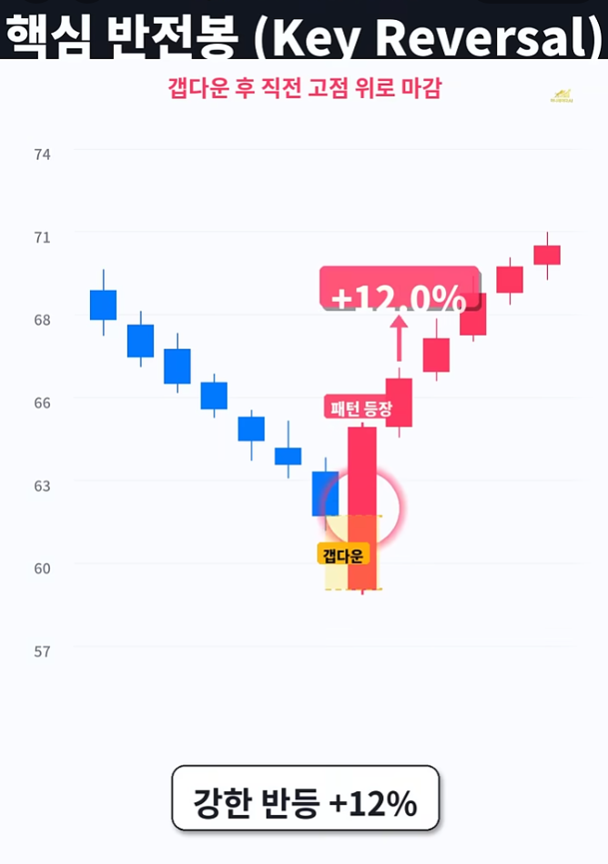</td>
    <td></td>
    <td>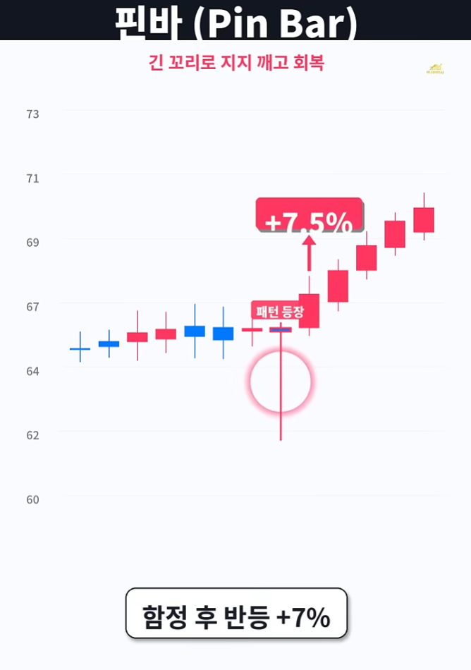</td>
  </tr>
  <tr>
    <td>❶ <b>반전봉</b></td>
    <td colspan="3">직전저점깨고 종가 더 높이마감하면 반등 시작</td>
  </tr>
  <tr>    
    <td>❷ <b>핵심반전봉</b></td>
    <td colspan="3">갭다운후 직전 고점위로 마감</td>
  </tr>
  <tr>    
    <td>❸ <b>소진봉</b></td>
    <td colspan="3">갭다운후 큰양봉이 나오면 매도가 소진된 신호</td>
  </tr>
  <tr>    
    <td>❹ <b>핀바</b></td>
    <td colspan="3">긴 꼬리로 지지를 살짝 깨고 회복하면 함정후 반등</td>
  </tr>
  <tr align="center" valign="top">
    <td>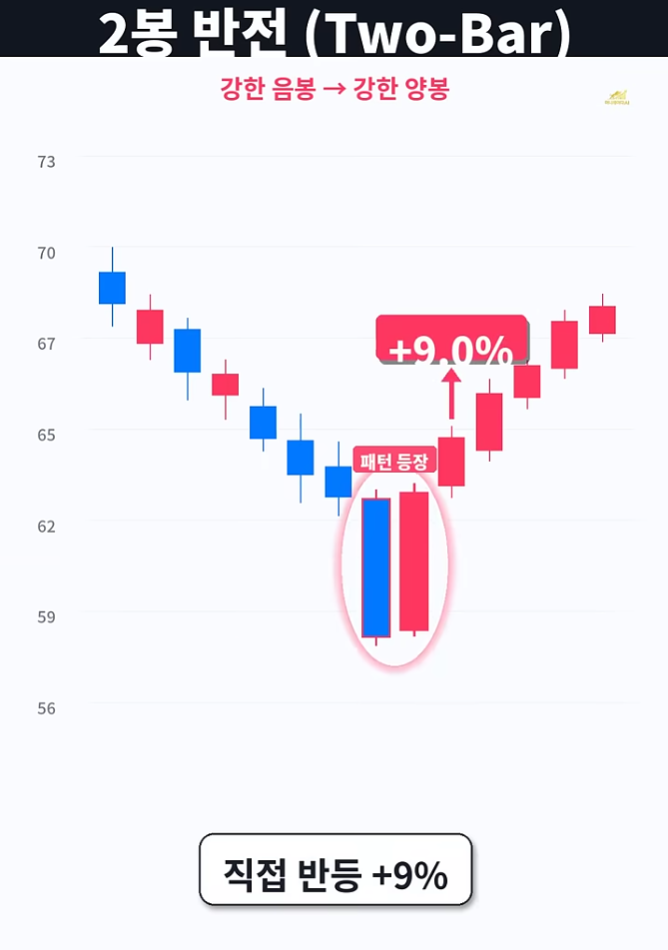</td>
    <td>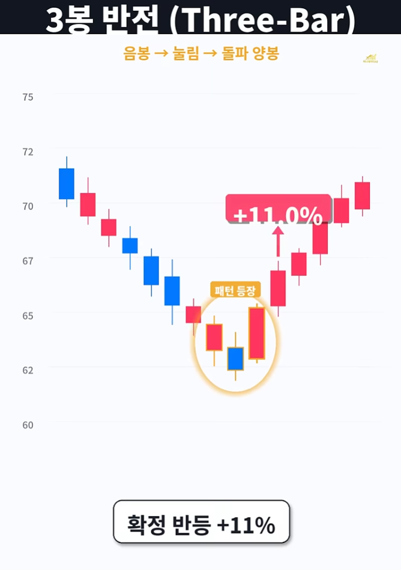</td>
    <td></td>
    <td>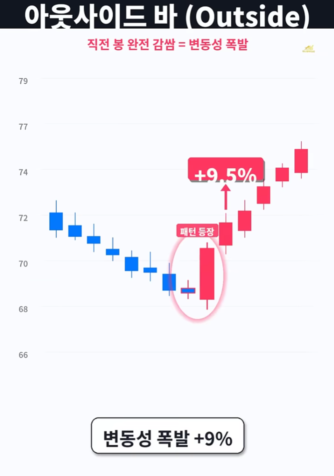</td>
  </tr>
  <tr>    
    <td>❺ <b>2봉 반전</b></td>
    <td colspan="3">강한 음봉 다음에 강한 양봉이면 직접적인 반전 신호</td>
  </tr>
  <tr>    
    <td>❻ <b>3봉 반전</b></td>
    <td colspan="3">음봉 눌림 돌파양봉 순서로 가장 보수적인 확정 신호</td>
  </tr>
  <tr>    
    <td>❼ <b>인사이드바</b></td>
    <td colspan="3">캔들이 직전봉안에 갇히면 변동성 수축 돌파 대기</td>
  </tr>
  <tr>    
    <td>❽ <b>아웃사이드바</b></td>
    <td colspan="3">직전봉을 완전히 돌전히 감싸면 변동성 폭발 신호 </td>
  </tr>
</table>
---

### 차트고수 5단계

<table>
  <tr align="center">
    <td><b>차트</b></td>
    <td><b>Sweep</b></td>
    <td><b>Gap</b></td>
    <td><b>전환</b></td>
    <td><b>박스</b></td>
    <td><b>돌파</b></td>
  </tr>
  <tr align="center">
    <td>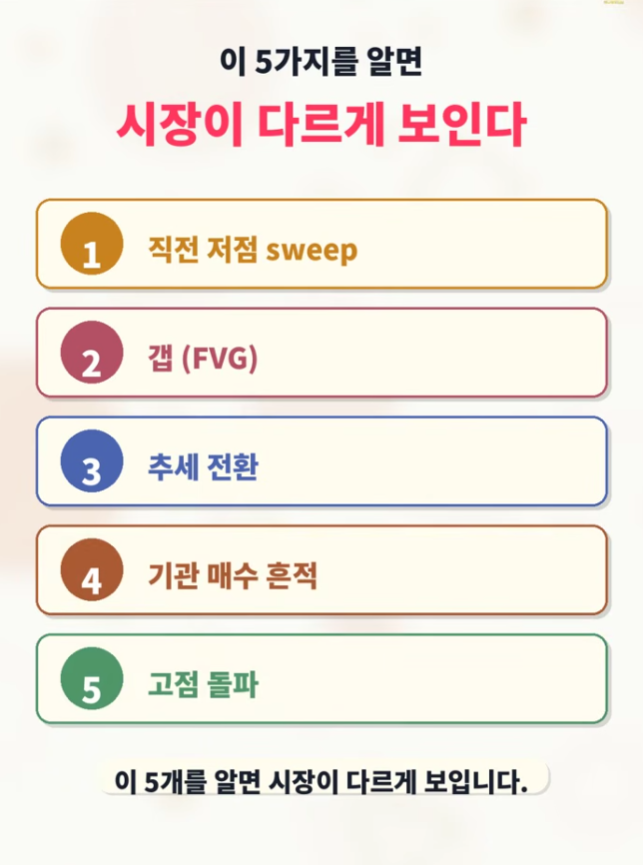</td>
    <td>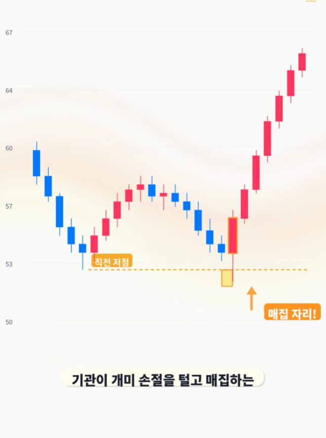</td>
    <td></td>
    <td></td>
    <td></td>
    <td></td>
  </tr>
  <tr align="center">
    <td>단계</td>
    <td>직전저점</td>
    <td>갭(FVG)</td>
    <td>추세전환</td>
    <td>기관매수</td>
    <td>고점돌파</td>
  </tr>
  <tr valign="top">
    <td align="center">메모</td>
    <td>Sweep 개미손절후 상승하는 자리</td>
    <td>강한양봉사이 빈공간은 다시 채우려 함 </td>
    <td>고점과 저점이 점점 낮아지면 추세반전</td>
    <td>큰 음봉후 다시 반등하는 자리, 돌파박스 매수</td>
    <td>직전고점 강한돌파, 리테스트후 매수</td>
  </tr>
</table>

---

### 익절신호

<table>
  <tr align="center">
    <td></td>
    <td></td>
    <td>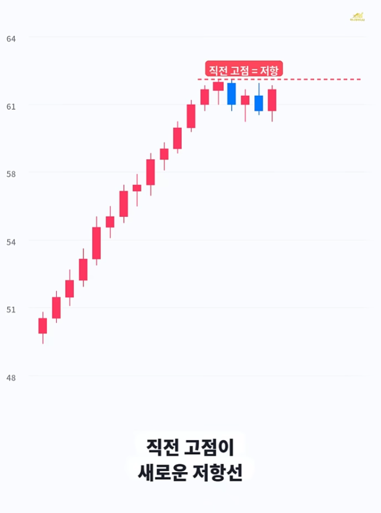</td>
    <td></td>
    <td></td>
  </tr>
  <tr align="center">
    <td></td>
    <td></td>
    <td></td>
    <td>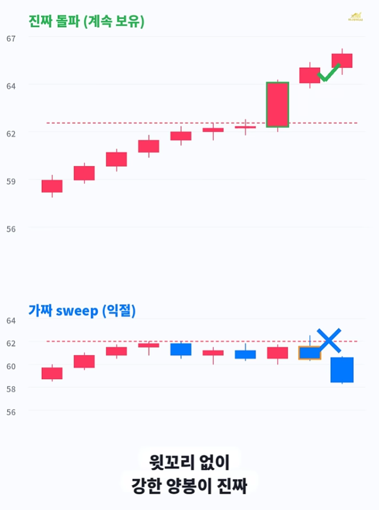</td>
    <td></td>
  </tr>
</table>

---

### 컵앤핸들

<table>
  <tr align="center">
    <td></td>
    <td></td>
    <td>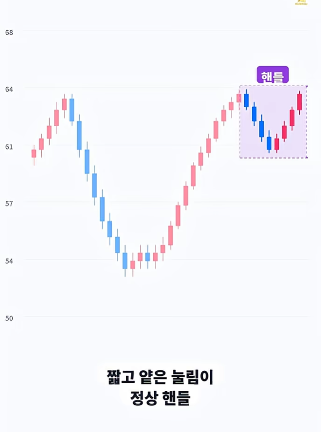</td>
    <td>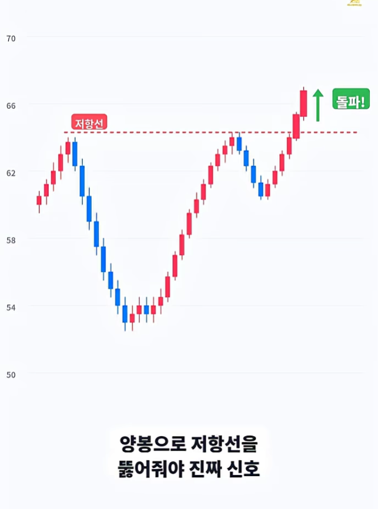</td>
  </tr>
  <tr align="center">
    <td></td>
    <td></td>
    <td></td>
    <td></td>
  </tr>
  <tr align="center">
    <td colspan="4"><b>U자 바닥, 얕은 핸들, 양봉 돌파</b></td>
  </tr>
</table>

---

### AI패러다임이 만드는 미래
> 앞으로 10년 세상을 바꿔놓을 7종목

<table>
  <tr align="center">
    <td></td>
    <td></td>
    <td></td>
    <td></td>
  </tr>
  <tr align="center">
    <td></td>
    <td>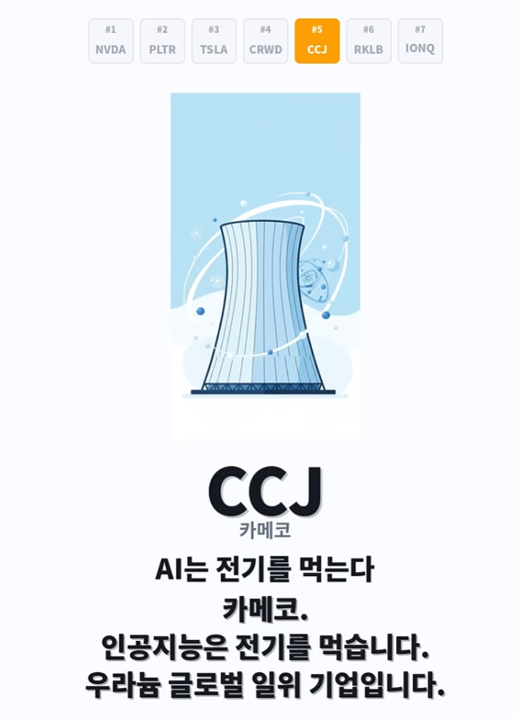</td>
    <td></td>
    <td></td>
  </tr>
  <tr align="center">
    <td colspan="4"><b>엔비디아, 팔란티어, 테슬라, 크라우드스트라이크, 카메코, 로켓랩, 아이온큐</b></td>
  </tr>
</table>

