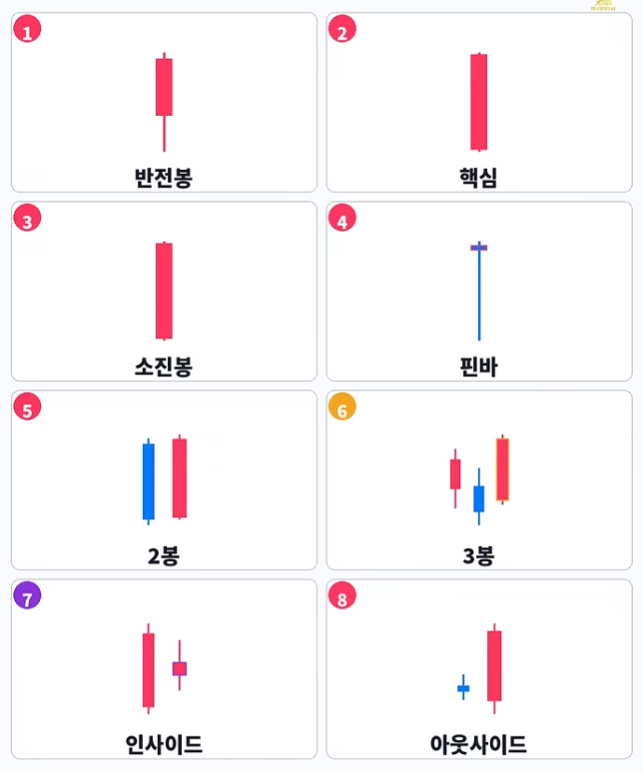

# 차트분석
> 머니레이다 쇼츠 : [Money Radar AI Shorts](https://www.youtube.com/@moneyradar-ai/shorts)

### 매수캔들 8가지

---

### 차트고수 5단계

<table>
  <tr align="center">
    <td><b>차트</b></td>
    <td><b>Sweep</b></td>
    <td><b>Gap</b></td>
    <td><b>전환</b></td>
    <td><b>박스</b></td>
    <td><b>돌파</b></td>
  </tr>
  <tr align="center">
    <td></td>
    <td></td>
    <td></td>
    <td></td>
    <td></td>
    <td></td>
  </tr>
  <tr align="center">
    <td>단계</td>
    <td>직전저점</td>
    <td>갭(FVG)</td>
    <td>추세전환</td>
    <td>기관매수</td>
    <td>고점돌파</td>
  </tr>
  <tr valign="top">
    <td align="center">메모</td>
    <td>Sweep 개미손절후 상승하는 자리</td>
    <td>강한양봉사이 빈공간은 다시 채우려 함 </td>
    <td>고점과 저점이 점점 낮아지면 추세반전</td>
    <td>큰 음봉후 다시 반등하는 자리, 돌파박스 매수</td>
    <td>직전고점 강한돌파, 리테스트후 매수</td>
  </tr>
</table>

---

### 익절신호

<table>
  <tr align="center">
    <td></td>
    <td></td>
    <td></td>
    <td></td>
    <td></td>
  </tr>
  <tr align="center">
    <td></td>
    <td></td>
    <td></td>
    <td></td>
    <td></td>
  </tr>
</table>

