🏠 > [stock](../) > [종목분석](./) > `테마_반도체`

## 테마_반도체

### INDEX

- [글로벌 반도체 대표기업 9선](#글로벌-반도체-대표기업-9선)

---
### 글로벌 반도체 대표기업 9선
> - DRAM, NAND, HBM, CPU, GPU, ASIC, Foundry, 장비, MLCC
> - 한국기업 : 삼성전자, SK하이닉스, 삼성전기

<table>
  <tr align="center">
    <td>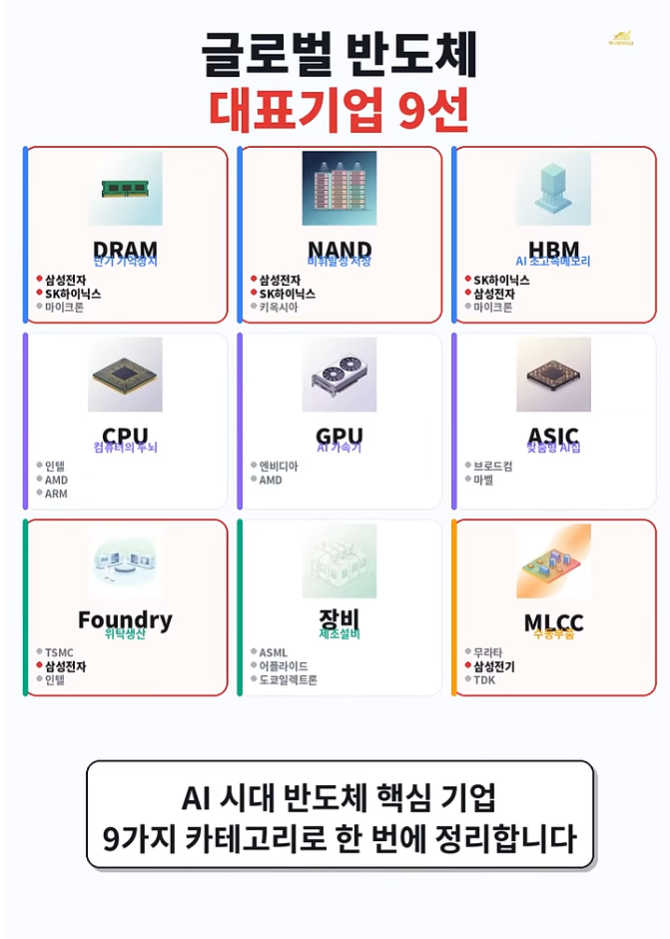</td>
    <td>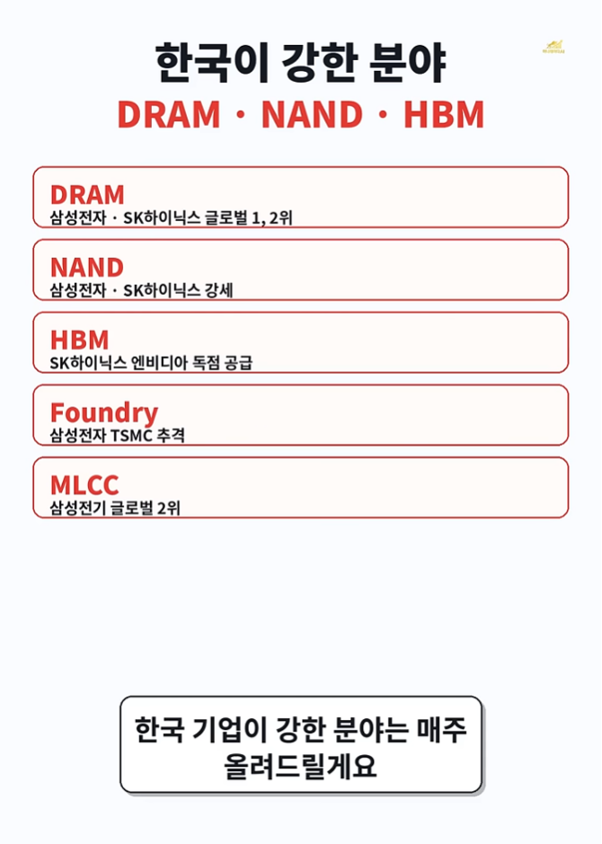</td>
  </tr>
  <tr align="center">
    <td>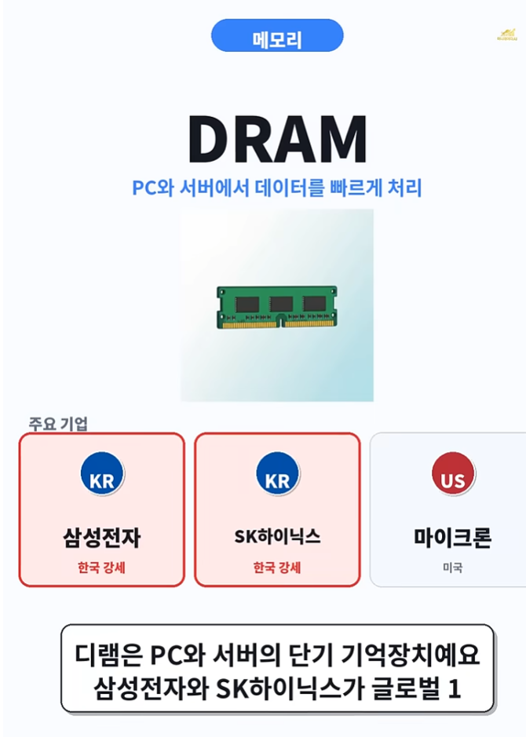</td>
    <td>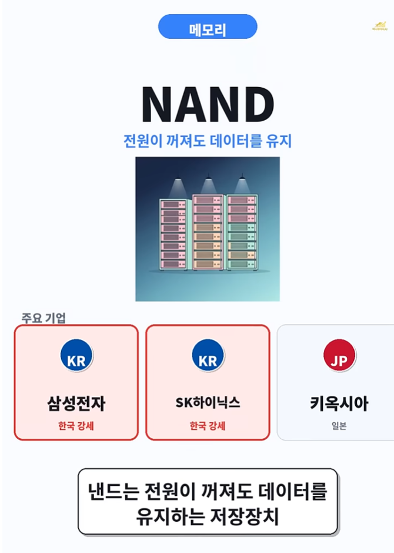</td>
    <td>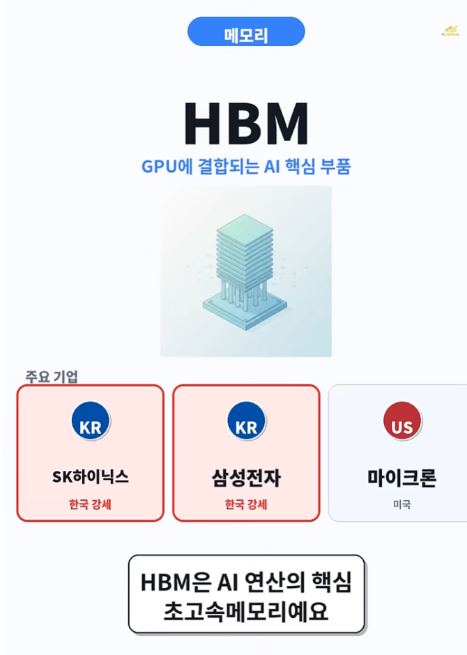</td>
  </tr>
  <tr align="center">
    <td>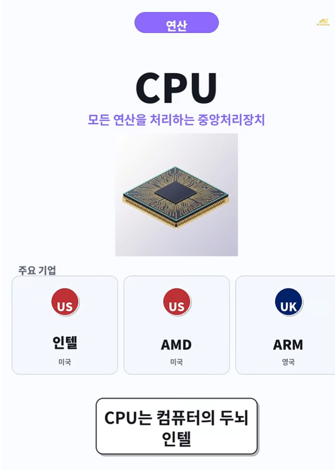</td>
    <td>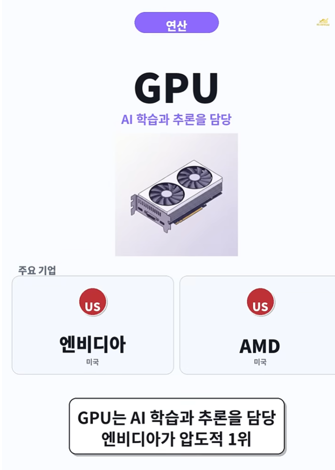</td>
    <td>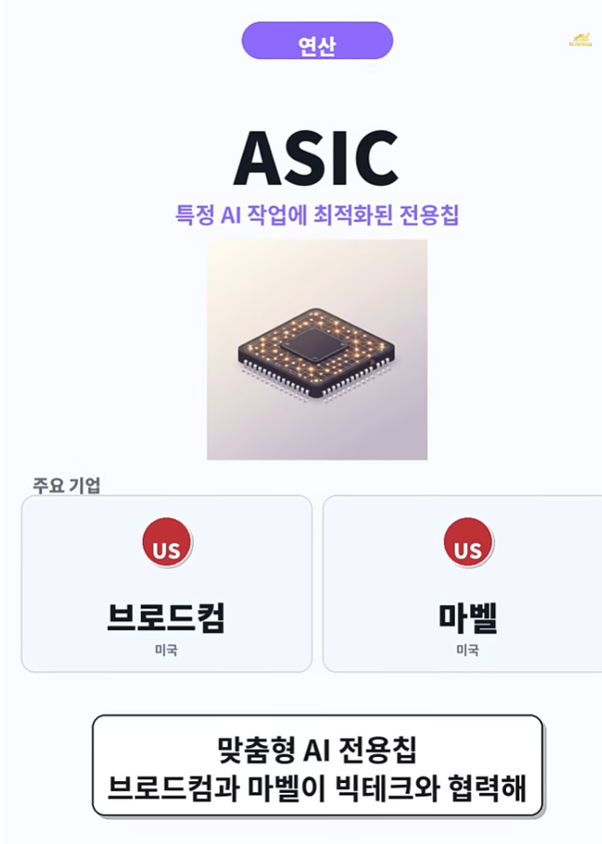</td>
  </tr>
  <tr align="center">
    <td>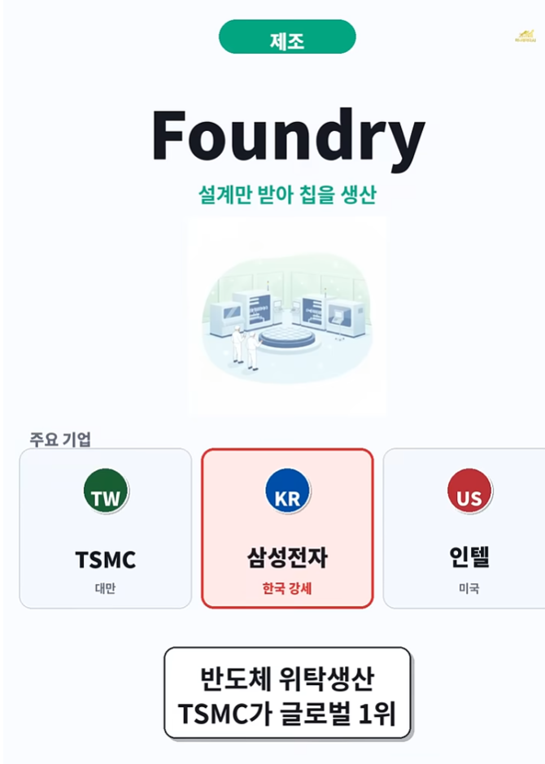</td>
    <td>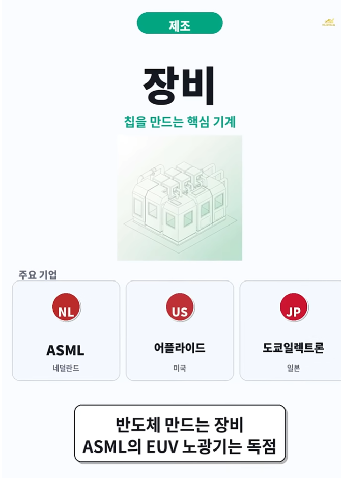</td>
    <td>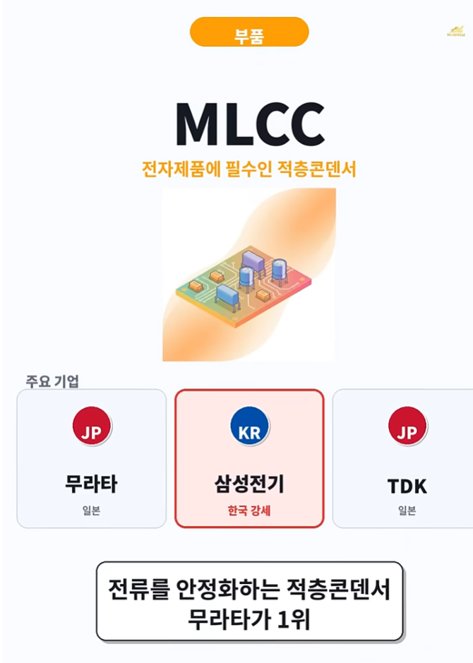</td>
  </tr>
  <tr align="center">
    <td colspan="3"><b>삼성전자, SK하이닉스, 삼성전기</b></td>
  </tr>
</table>

 

[[TOP]](#index)

---

