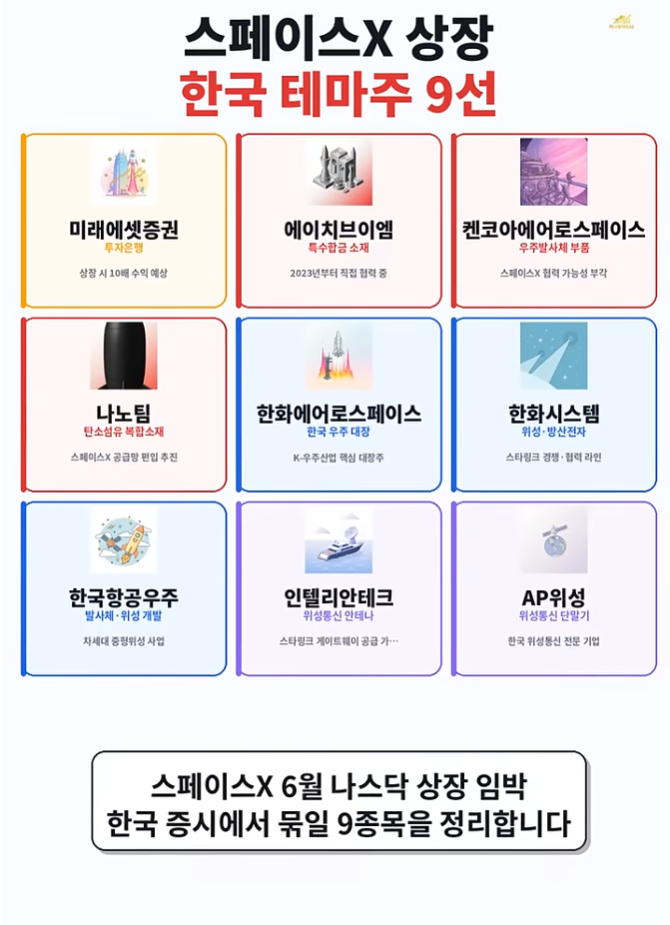
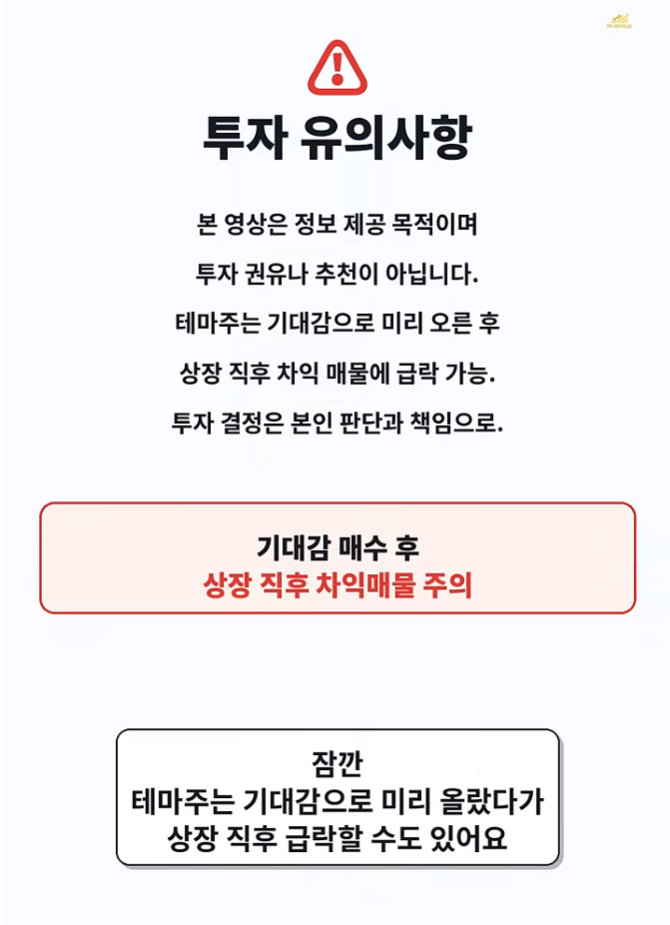
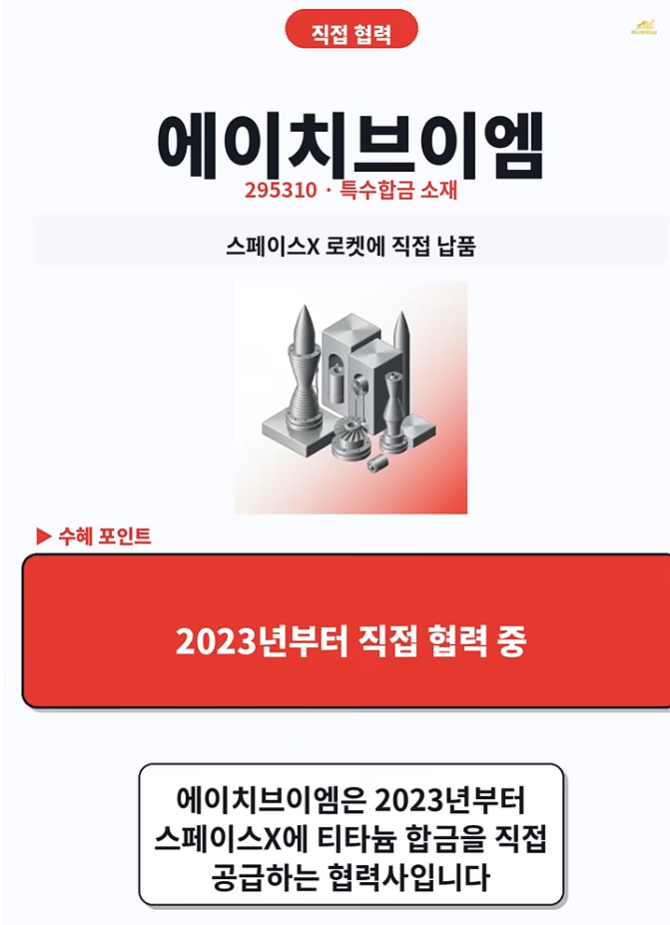
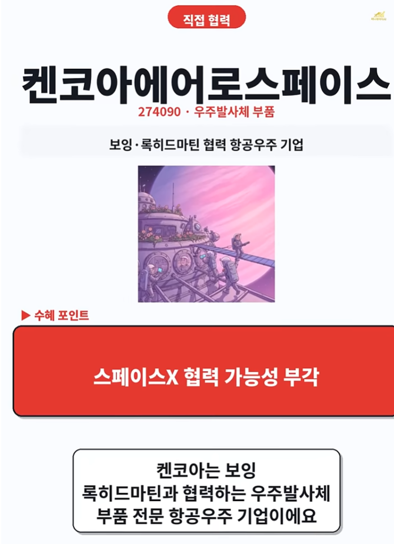
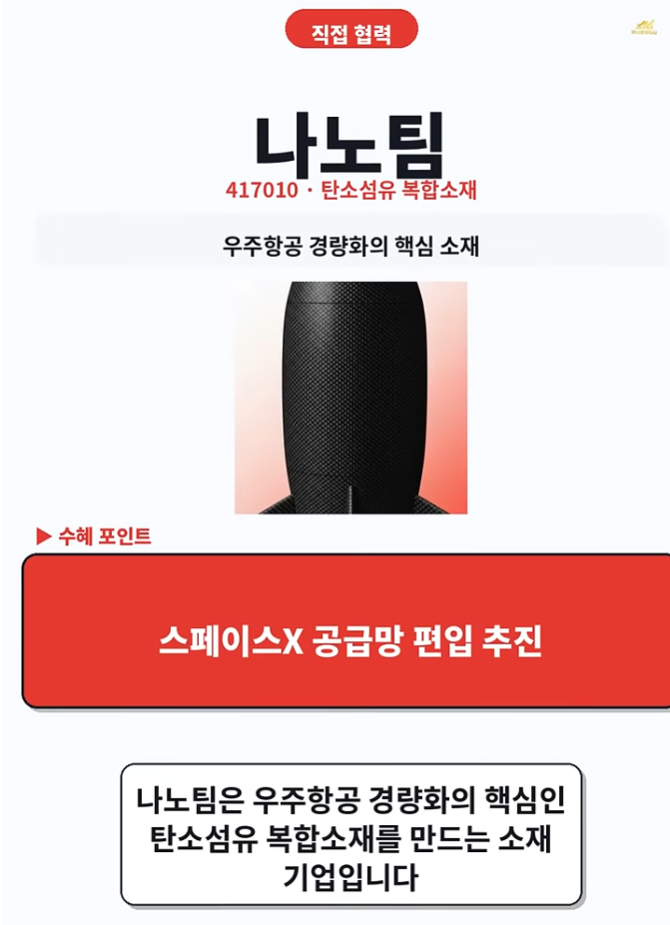
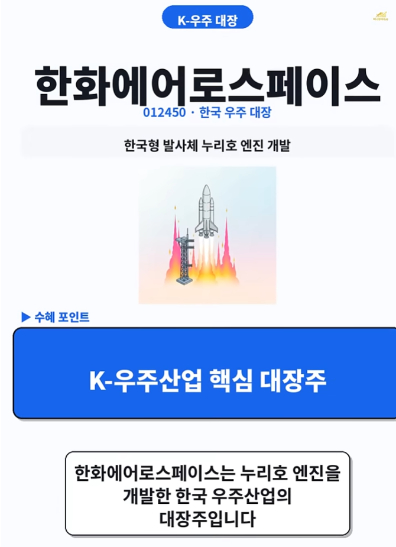
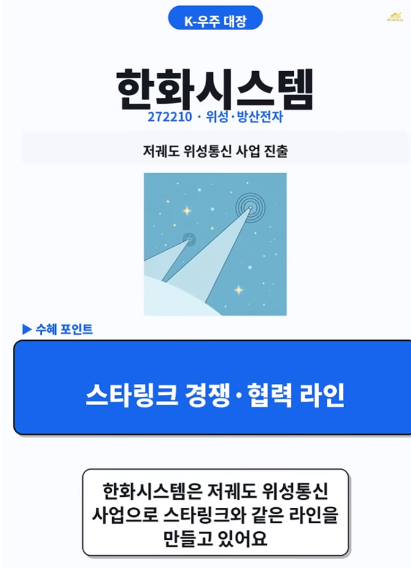
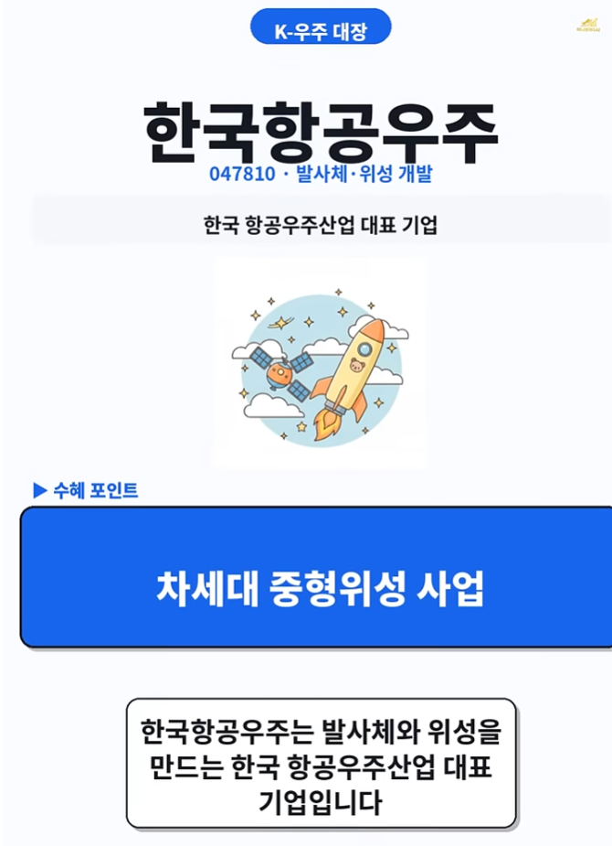

스페이스X_상장🏠 > [stock](../) > [종목분석](./) > `테마_스페이스X`

## 테마_원전

### INDEX

- [스페이스X 상장 한국테마주 9선](#스페이스x-상장-한국테마주-9선)

---
### 스페이스X 상장 한국테마주 9선
> - 스페이스X 6월 나스닥 상장 임박!
> - 미래에셋증권, 에이치브이엠, 켄코아에어로스페이스, 나노팀, 한화에어로스페이스(우주산업 대장주), 한화시스템, 한국항공우주, 인텔리안테크, AP위성

<table>
  <tr align="center">
    <td></td>
    <td></td>
  </tr>
  <tr align="center">
    <td></td>
    <td></td>
    <td></td>
  </tr>
  <tr align="center">
    <td></td>
    <td></td>
    <td></td>
  </tr>
  <tr align="center">
    <td></td>
    <td></td>
    <td></td>
  </tr>
  <tr align="center">
    <td colspan="3"><b>미래에셋증권, 에이치브이엠, 켄코아에어로스페이스, 나노팀, 한화에어로스페이스(우주산업 대장주), 한화시스템, 한국항공우주, 인텔리안테크, AP위성</b></td>
  </tr>
</table>

 

[[TOP]](#index)

---

