🏠 > [stock](../) > [종목분석](./) > `테마_원전`

## 테마_원전

### INDEX

- [AI시대 K-원전 르네상스 9선](#ai시대-k-원전-르네상스-9선)

---
### AI시대 K-원전 르네상스 9선
> - 두산에너빌리티(대장), 현대건설, 비에이치아이, 한전기술, 한전KPS, 우리기술, 일진파워, LS ELECTRIC, 한국전력

<table>
  <tr align="center">
    <td>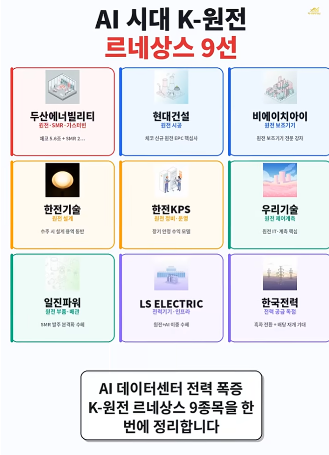</td>
    <td>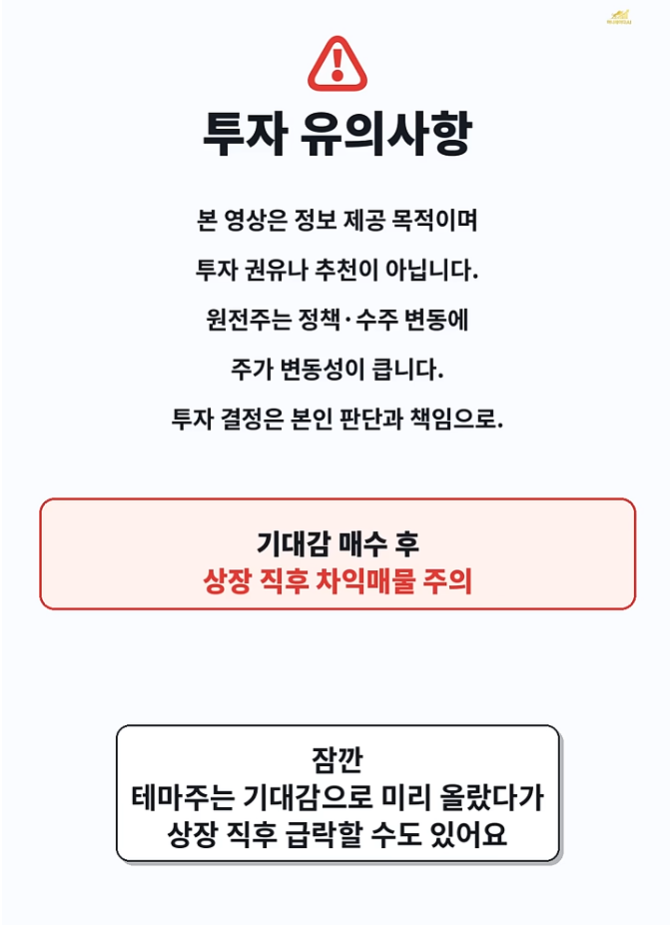</td>
  </tr>
  <tr align="center">
    <td>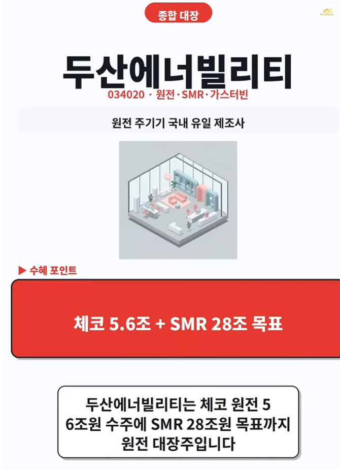</td>
    <td>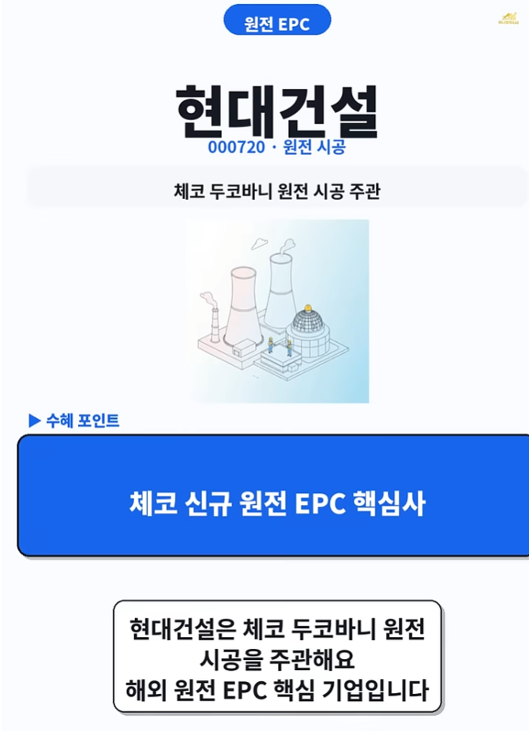</td>
    <td>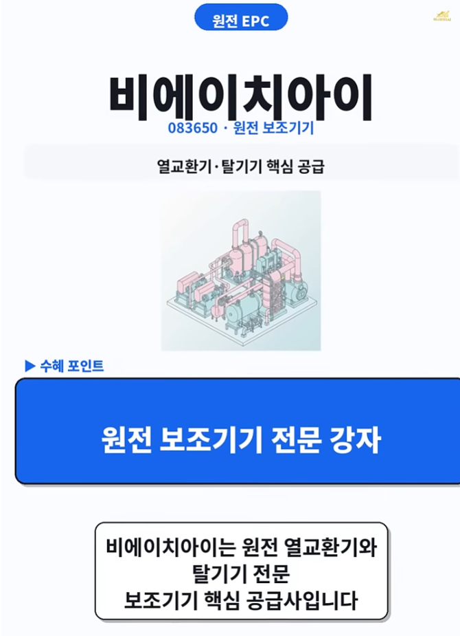</td>
  </tr>
  <tr align="center">
    <td>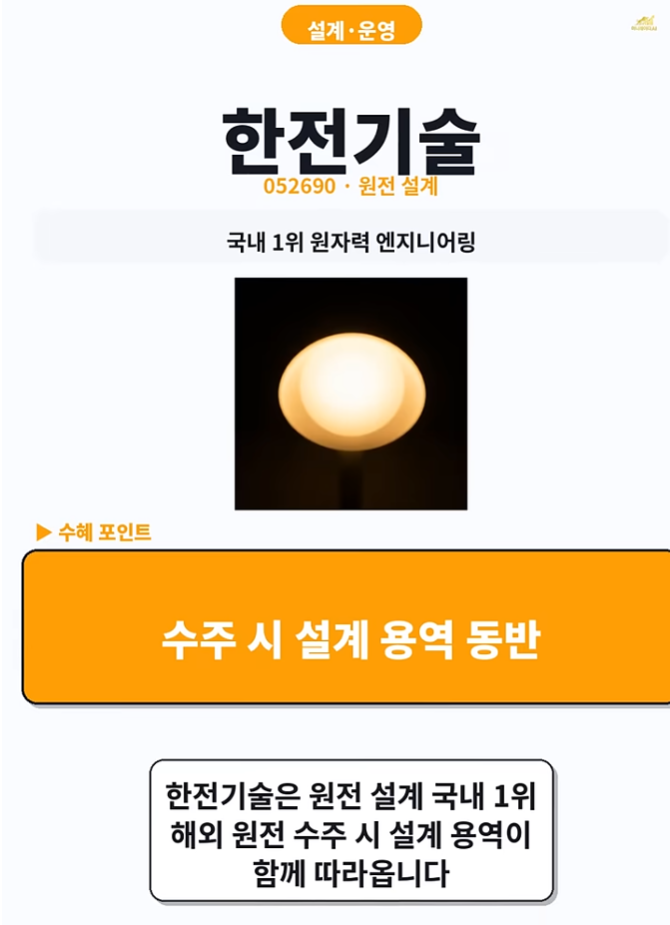</td>
    <td>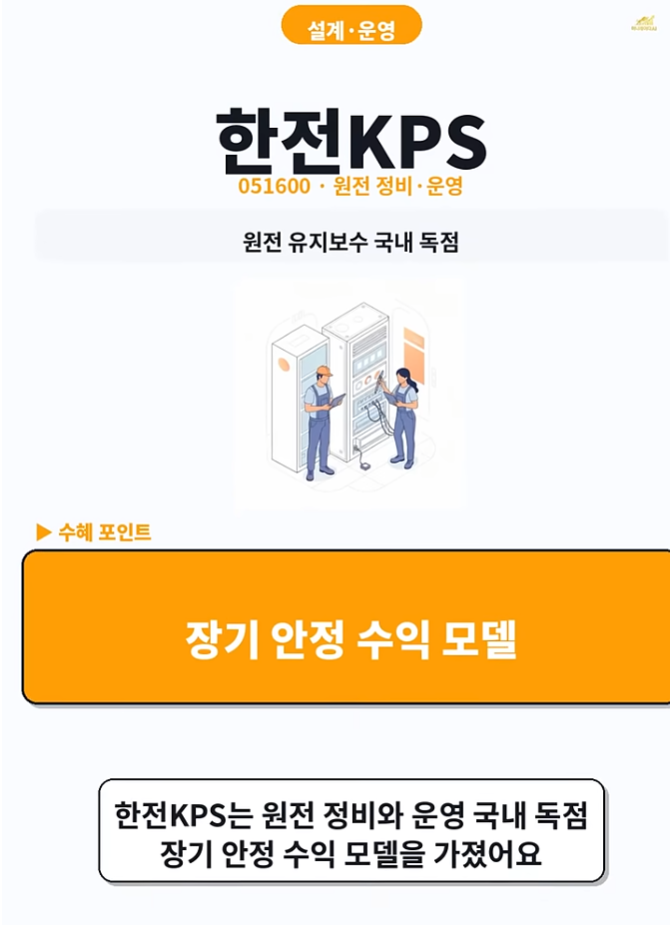</td>
    <td>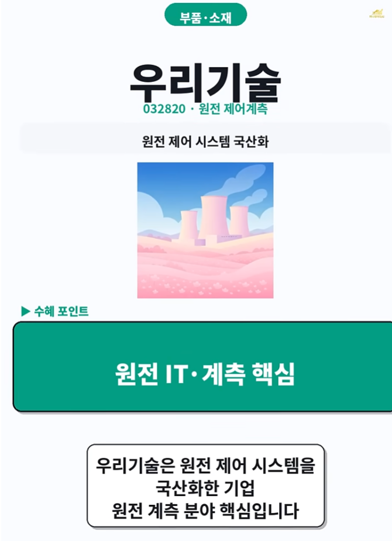</td>
  </tr>
  <tr align="center">
    <td>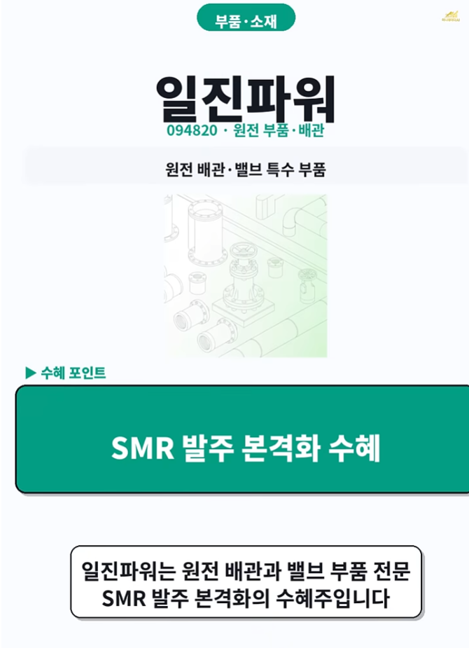</td>
    <td>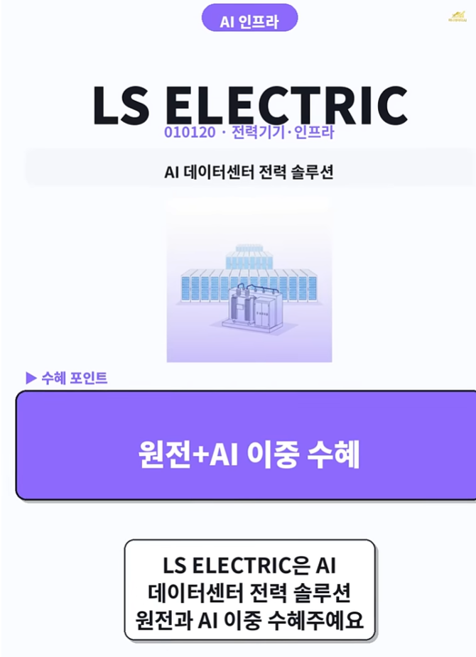</td>
    <td>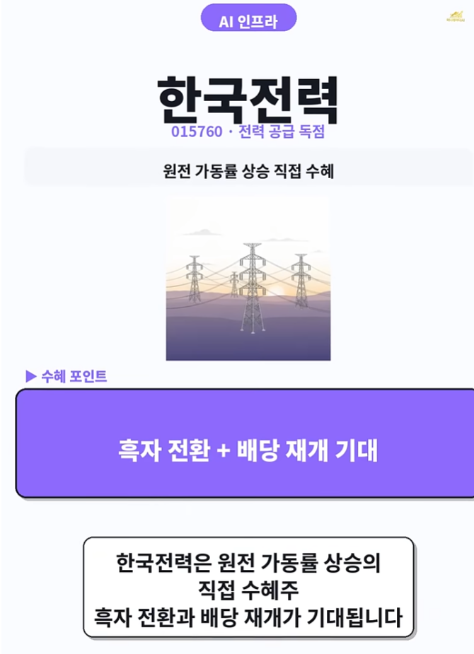</td>
  </tr>
  <tr align="center">
    <td colspan="3"><b>두산에너빌리티(대장), 현대건설, 비에이치아이, 한전기술, 한전KPS, 우리기술, 일진파워, LS ELECTRIC, 한국전력</b></td>
  </tr>
</table>

 

[[TOP]](#index)

---

