🏠 > [stock](../) > [차트분석](./) > `Shorts-주식단테`

### INDEX

- [주식복기](#주식복기)
- [주식에서 수익나는 차트패턴](#주식에서-수익나는-차트패턴)
- [세력이 만드는 찐고점](#세력이-만드는-찐고점)

---
## 차트분석
> 주식단테 쇼츠 : [주신단테 Shorts](https://www.youtube.com/@주식단테/shorts)

---
### 주식복기
> 손절이유, 매수이유, 심리기록

<table>
  <tr valign="top">
    <td>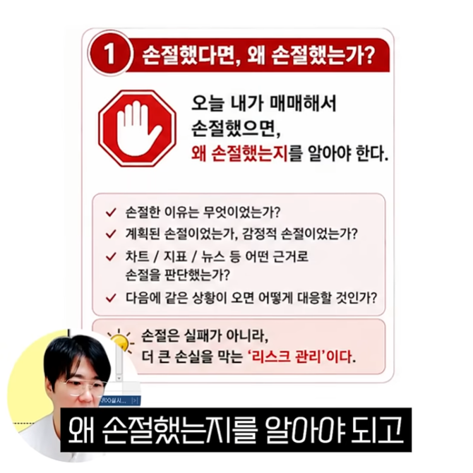</td>
    <td>
      <h3>❶ 손절했다면, 왜 손절했는가?</h3>
      <b>오늘 매매해서 손절했으면,   왜 손절했는지를 알아야 한다.</b>
      <ul>
        <li> 손절한 이유는 무엇이었는가?
        <li> 계획된 손절이었는가, 감정적 손절이었는가?
        <li> 차트 / 지표 / 뉴스 등 어떤 근거로 손절을 판단했는가?
        <li> 다음에 같은 상황이 오면 어떻게 대응할 것인가?
      </ul>
      <b>손절은 실패가 아니라,   더 큰 손실을 막는 '리스크 관리' 이다. </b>
    </td>
  </tr>
  <tr valign="top">
    <td>
      <h3>❷ 샀다면, 왜 샀고 잘 샀는가?</h3>
      <b>내가 이걸 샀으면,   왜 샀는지, 잘 샀는지 평가를 해야 한다.</b>
      <ul>
        <li> 매수의 근거는 무엇이었는가?
        <li> 시점은 적절했는가? (진입 타이밍 평가)
        <li> 예상한 시나리오대로 흘러갔는가?
        <li> 목표 수익 / 손절 라인을 지켰는가?
        <li> 더 좋은 매매를 위해 무엇을 개선할 수 있을까?
      </ul>
      <b>좋은 매매는 우연이 아니다.   기록하고 평가해야 실력이 된다. </b>
    </td>
    <td>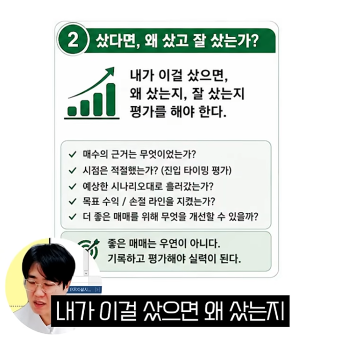</td>
  </tr>
  <tr valign="top">
    <td>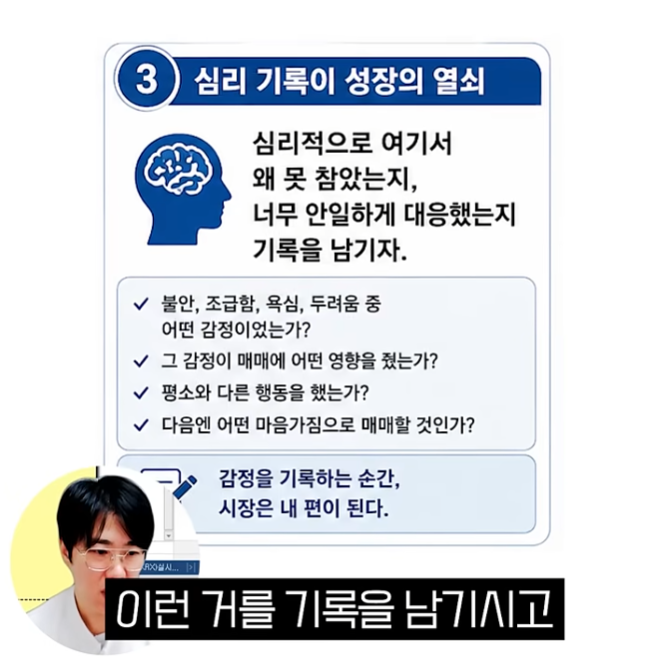</td>
    <td>
      <h3>❸ 심리 기록이 성장의 열쇠</h3>
      <b>심리적으로 여기서 왜 못 참았는지,   너무 안일하게 대응했는지 기록을 남기자.</b>
      <ul>
        <li> 불안, 조급함, 욕심, 두려움 중 어떤 감정이었는가?
        <li> 그 감정이 매매에 어떤 영향을 줬는가?
        <li> 평소와 다른 행동을 했는가?
        <li> 다음엔 어떤 마음가짐으로 매매할 것인가?
      </ul>
      <b>감정을 기록하는 순간,   시장은 내 편이 된다. </b>
    </td>
  </tr>
</table>  
 

[[TOP]](#index)

---
### 주식에서 수익나는 차트패턴
> 역헤드앤숄더, 쌍바닥 전고돌파, 짝궁뎅이 쌍바닥

<table>
  <tr valign="top">
    <td>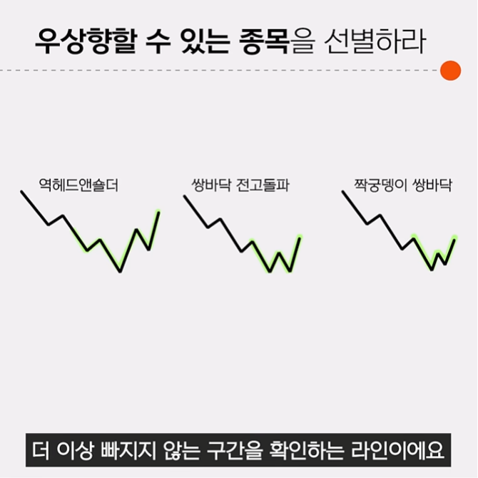</td>
    <td colspan="2">
      <h4>주식에서 수익나는 법</h4>
      <ul>
        <li> <b>첫째. 우상향 할 수 있는 종목을 선별하라</b>
        <li> <b>둘째. 더이상 빠지지 않는 구간을 확인하고 들어가라</b>
        <li> <b>그리고 시간을 투자한다.</b>
      </ul>
      <h4>수익차트 패턴</h4>
      <ul>
        <li> <b>역헤드앤숄더</b>
        <li> <b>쌍바닥 전고돌파</b>
        <li> <b>짝궁뎅이 쌍바닥</b>
      </ul>
    </td>
  </tr>
  <tr align="center" valign="top">
    <td>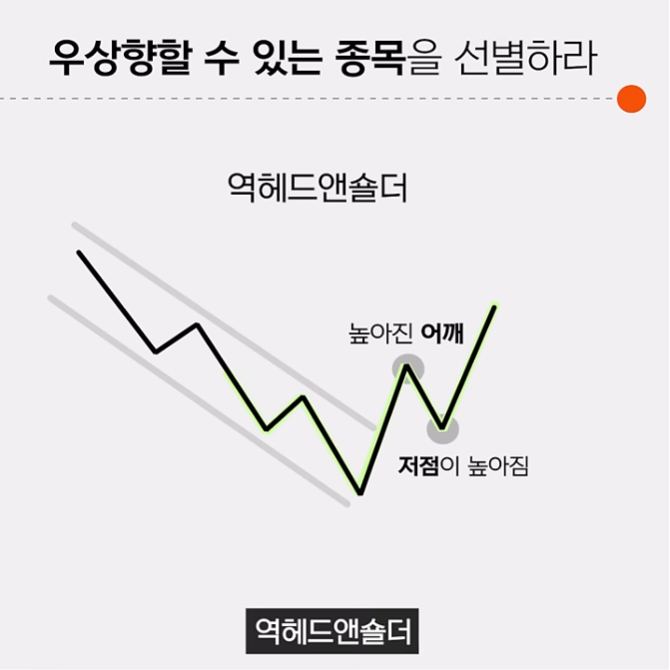</td>
    <td>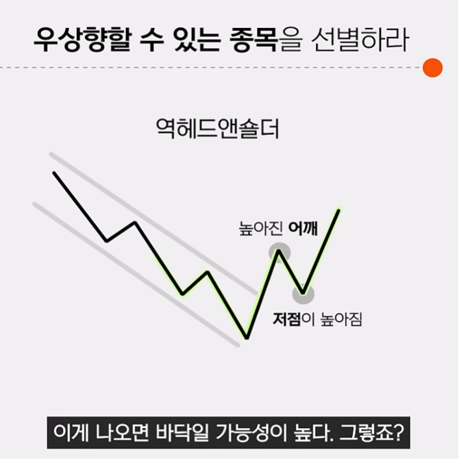</td>
    <td>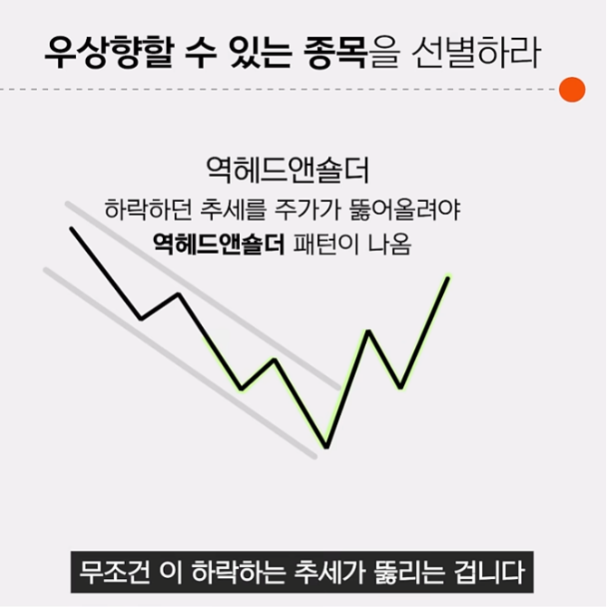</td>
  </tr>
  <tr align="center" valign="top">
    <td>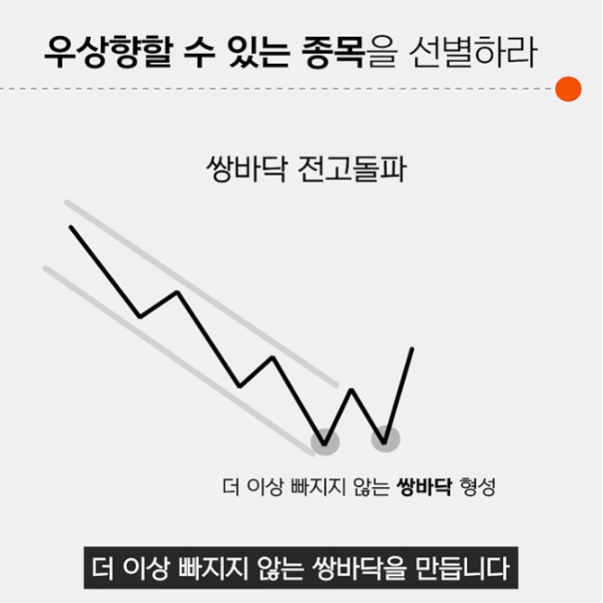</td>
    <td>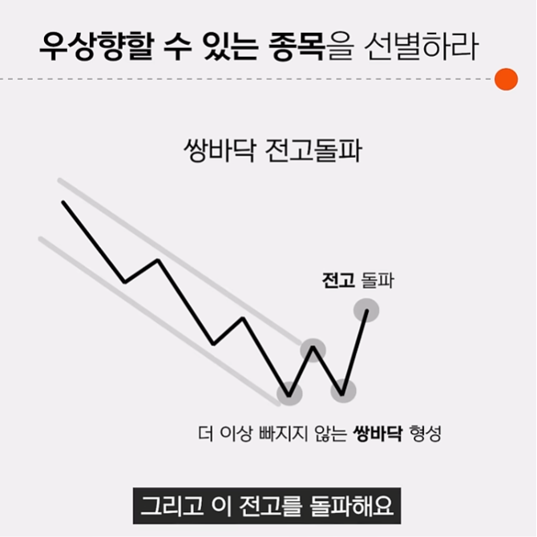</td>
    <td>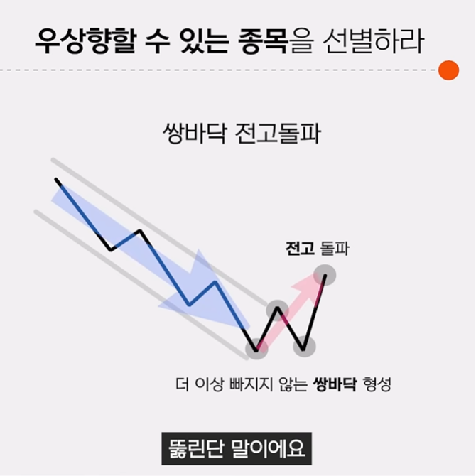</td>
  </tr>
  <tr align="center" valign="top">
    <td>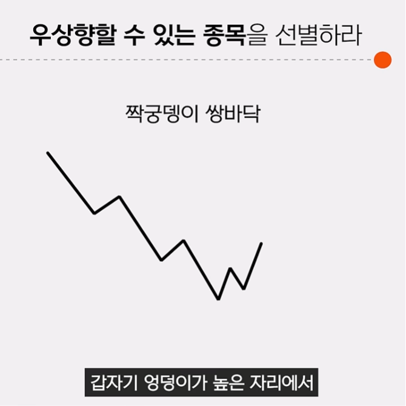</td>
    <td>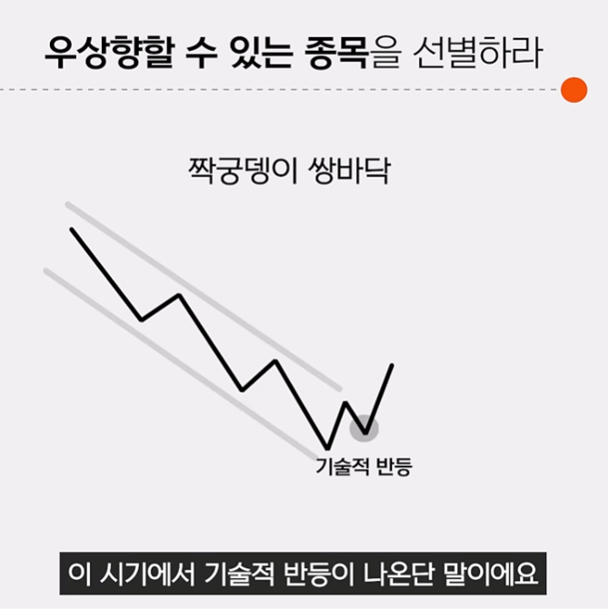</td>
  </tr>
</table>  
 

[[TOP]](#index)

---
### 세력이 만드는 찐고점
> 실제 2026.04.03 동국제강 차트분석

<table>
  <tr align="center" valign="top">
    <td>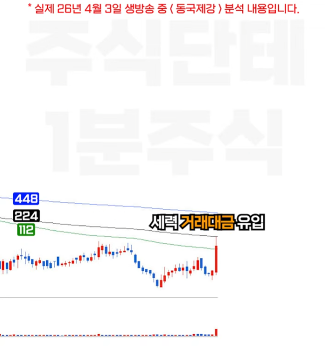</td>
    <td>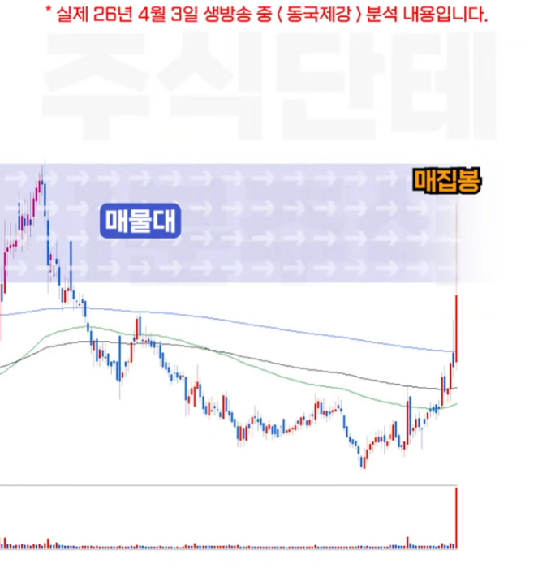</td>
  </tr>
  <tr align="center" valign="top">
    <td>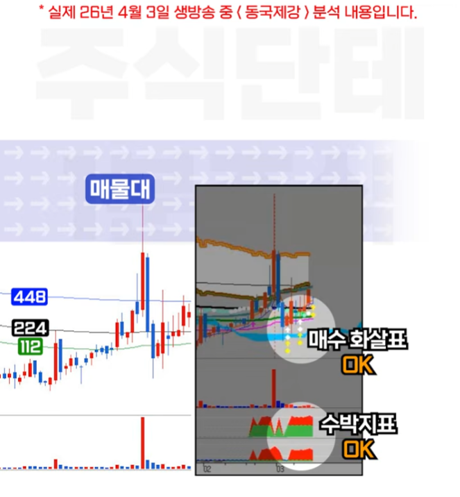</td>
    <td>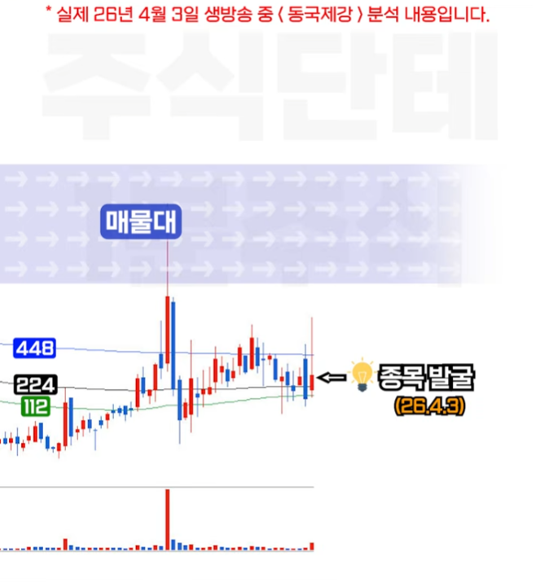</td>
  </tr>
  <tr align="center" valign="top">
    <td>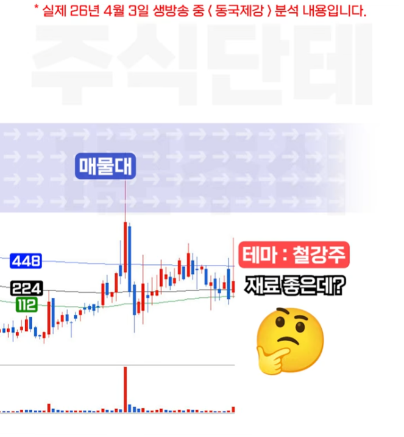</td>
    <td>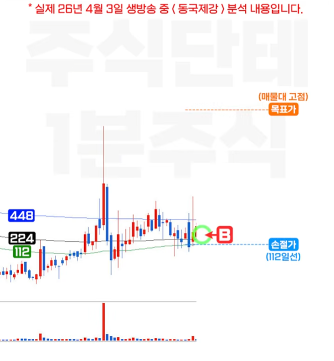</td>
  </tr>
  <tr align="center" valign="top">
    <td>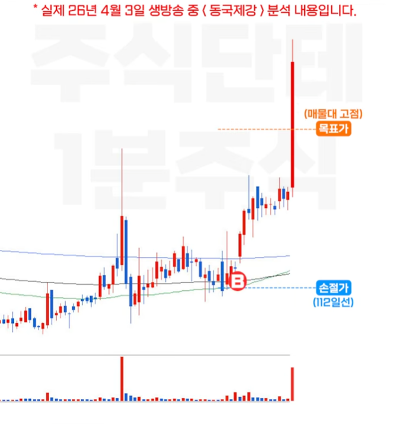</td>
    <td>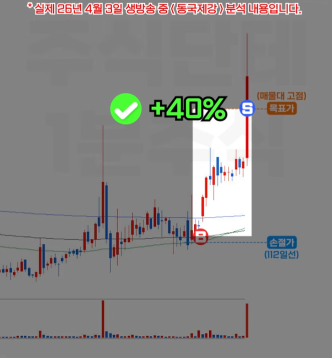</td>
  </tr>
  <tr align="center" valign="top">
    <td>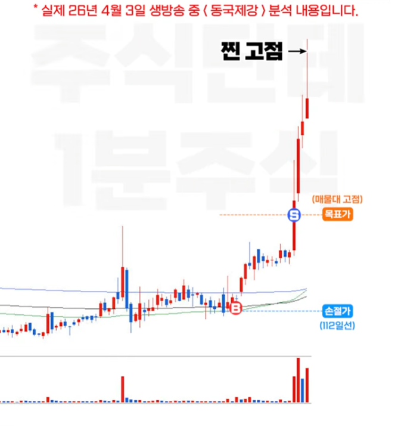</td>
    <td>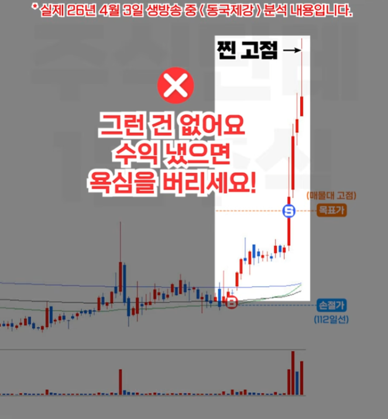</td>
  </tr>
</table>  
 

[[TOP]](#index)

---