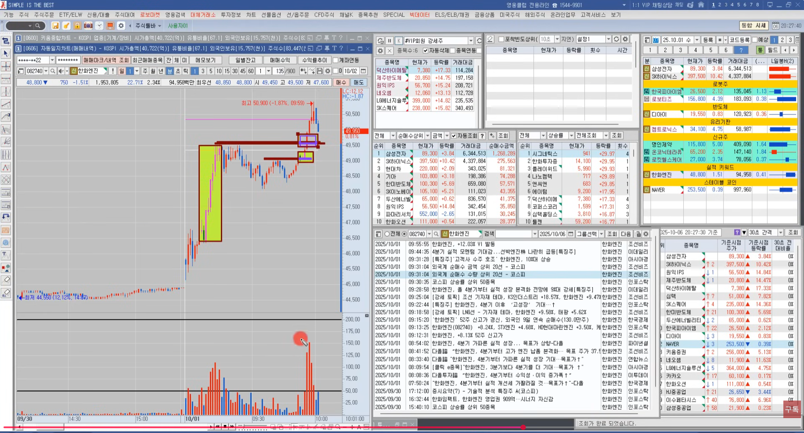
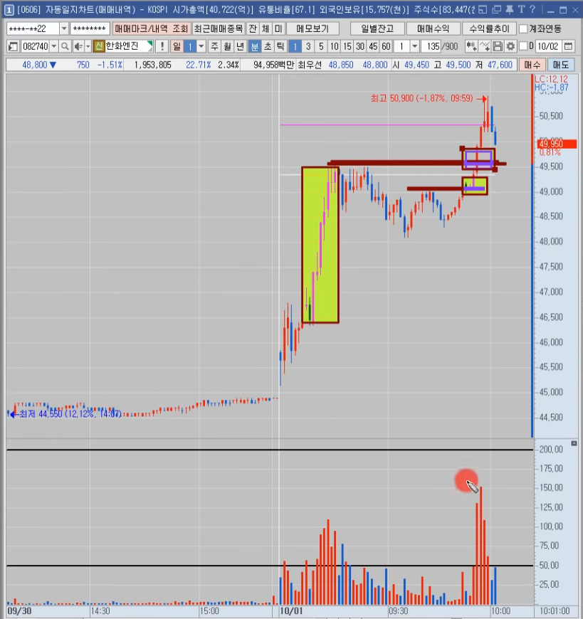
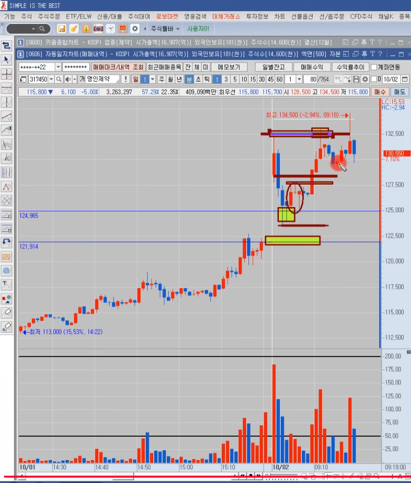
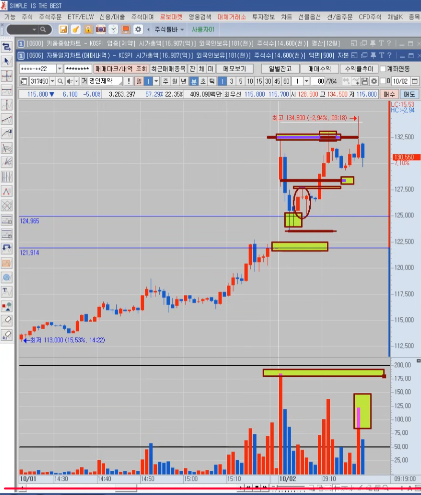

### 돌파 트레이더 유형 분석
> 이거 모르면 파산
> [유형분석영상](https://www.youtube.com/watch?v=xn_JoaWm85g)

### 돌파트레이더 분류

No | 분류 | 차이점 | 특징 
---|-----|-------|-----
❶ | 스캘퍼        | 순간 | 첫상승파동 / 종목압축 느슨 / 매매스킬로 커버
❷ | 데이트레이더   | 파동 | 첫상승파동 이후 / 종목압축 중요 / 주도주
❸ | 상따          | 추세 | 상한가 직전 / 2번째 VI이후 / 25%~27% 상승이후 분위기

- 스캘퍼 매매타점
  - 일봉상 전고점 돌파
  - 최근 박스권 상단 돌파
  - 전일 종가이자 고가 돌파
  - 1분봉상 거래대금 50억이상 터질때 3% 이상 양봉 진입
  - 10% 길목구간 통과할때 진입

- 스캘퍼 특징
  - 스캘퍼는 순간을 보고 진입한다
  - 매수 시그널
  - 자기 매매 스킬에 자신감이 있는 사람들
  - 샀다가 안가면 바로 손절하면 그만인데 뭐가 문제야
  - 종목 압축이 느슨 > 주포와함께춤을
  - 무릎이 > 스캘퍼인데 종목 압축까지, 그러니까 승률이 좋음
  - 갈것 같은 순간 시그널! 이걸 포착할 때 진입
  - 갈것 같을때 진입했는데 안가면 뭐에요? 손절을 해야죠

- 개미들 특징
  - 갈것 같을때 진입했는데 안가면 기도를 한다.
  - 손절을 안한다. 손절을 못하는거지
  - 미수몰빵으로 들어가니까 순간 밀릴때 호가창이 매수벽이 얇은거에요
  - 손절타이밍에 그날 손실 본걸 복구하려고 추가입금하고 계속 매매하다가 계좌 반토막
  - 이런 짓거리를 하면 안된다.

### 돌파매매 분석

  

